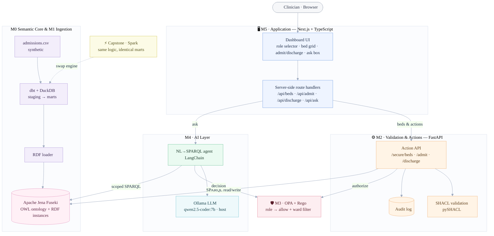
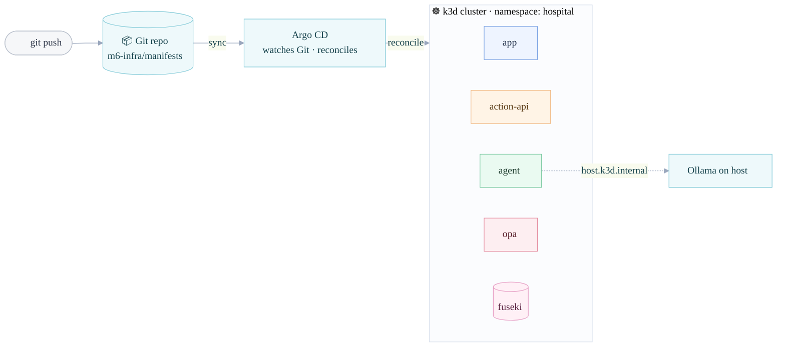

# Reference Ontology Platform

A working **reference implementation** of an ontology-driven operational data
platform, built one stack layer at a time. The running domain is **Hospital Bed
& Patient Flow** — modelled, validated, secured, queried, and deployed.

> ⚠️ **This is a learning prototype on synthetic data, not a production system.**
> It demonstrates every architectural layer end-to-end on one laptop. It is not
> built for scale, concurrency, real auth, or live integrations. The capstone
> makes that gap an explicit, assessed outcome.
>
> **Security note — do not copy these patterns into production:**
> - **No authentication.** Identity is a plain string passed with each request
>   (`user: "manager_carol"`); any caller can claim any role. The Module 3 OPA
>   policy is an *illustrative* authorization model, not real authn.
> - **No PHI, ever.** All data is obviously-fake synthetic data (`SYN-P00001`,
>   "Test Patient Alpha"). Never load real patient data into this lab.
> - **Run it locally only.** Fuseki is started with update enabled and no auth —
>   do not expose its endpoint (`:3030`) or the APIs to an untrusted network.

Full lab spec: [`docs/mini_foundry_lab.md`](docs/mini_foundry_lab.md).
Build context & rules: [`CLAUDE.md`](CLAUDE.md).

## Why do these labs?

Most tutorials teach **one** slice of a data platform — a dbt project, an API, a
policy engine, an LLM agent — in isolation. The rare and valuable thing is seeing
how the layers *fit together* around one coherent domain: how a formal model
becomes an enforceable write, how access control threads through both the API and
the AI, how the same logic deploys as pods via GitOps. That whole-stack
integration is the architecture behind expensive enterprise platforms (e.g.
Palantir Foundry and other knowledge-graph / operational-intelligence systems) —
here you build a small one yourself, end to end, on one laptop.

**Who it's for.** Aspiring or practising **data / platform engineers, knowledge-
graph & ontology engineers, ML/AI engineers, backend engineers, and solutions
architects** — including anyone eyeing forward-deployed / solutions roles at
platform vendors. Prerequisites are light: basic Python, basic SQL, and comfort
with a terminal and Git. No prior semantic-web or Kubernetes experience needed.

**What you'll gain.**

- **Breadth that's rare and hireable** — you'll have touched modelling *through*
  deployment on one system, not just one tool in isolation.
- **Transferable mental models** — the *validate → write → log* guarded-action
  pattern; open-world model (OWL) vs closed-world enforcement (SHACL);
  policy-as-data outside app code; grounding an LLM against a schema so it can't
  hallucinate; GitOps self-heal.
- **Judgment, not just tools** — the capstone makes you state *what this is NOT*
  and reason about build-vs-buy, which is what separates an engineer from a
  tutorial-follower.
- **A portfolio artifact with honest framing** — see
  [`docs/portfolio_interview_guide.md`](docs/portfolio_interview_guide.md) for
  defensible CV claims and interview Q&A.

**Where the knowledge applies.** The domain is hospital bed flow, but every
pattern is domain-agnostic:

| Skill you build | Applies to |
|---|---|
| Ontology / knowledge-graph modelling (M0) | Master data, digital twins, supply-chain & asset graphs, fraud rings |
| ELT + lineage (M1) | Any analytics / data-platform team (dbt is industry standard) |
| Validated write-actions (M2) | Operational apps that safely *change* state — dispatch, order mgmt, clinical/industrial ops |
| Policy-based access control (M3) | Multi-tenant SaaS, object/row-level security, regulated data |
| Grounded NL→query AI (M4) | "Chat with your data", internal copilots, agentic analytics — without hallucination |
| Operational dashboard (M5) | Internal tools / control panels over live data |
| Containers + GitOps (M6) | Modern DevOps / platform-engineering delivery on Kubernetes |

**Time & cost.** ~30 hours total (M0, M2, M4 are the conceptual peaks worth the
most time). Everything is free/open-source and runs on one machine; M4 (local
LLM) and M6 (k3d) want Docker. You can also do just the modules you care about —
each builds on the live triplestore from the one before. To run and test the
finished build, see the [**RUNBOOK**](RUNBOOK.md).

## Architecture

**Runtime request flow** — a clinician's action travels through the app, the
guarded action API (validate → authorize → write → log), and the AI agent, all
over one governed triplestore:



**Delivery (M6)** — every component is containerised and runs in a local
Kubernetes cluster, reconciled from Git by Argo CD (GitOps):



## Built module by module

| Module | Layer | Stack | Status |
|--------|-------|-------|--------|
| [M0 — Domain & Ontology](m0-ontology/) | Semantic model | OWL/RDF + Fuseki + SPARQL | ✅ done |
| [M1 — Compute & Ingestion](m1-ingestion/) | Data plane | dbt + DuckDB → triplestore | ✅ done |
| [M2 — Validation & Actions](m2-actions/) | Kinetic | SHACL + FastAPI | ✅ done |
| [M3 — Dynamic Security](m3-security/) | Per-object security | OPA + Rego | ✅ done |
| [M4 — AI Layer](m4-ai/) | Grounded AI | Ollama + LangChain | ✅ done |
| [M5 — Application](m5-app/) | Presentation | Next.js + TypeScript | ✅ done |
| [M6 — Infra & Delivery](m6-infra/) | Substrate + GitOps | k3d + Argo CD | ✅ done |
| [Capstone](capstone/) | Scale & reflect | DuckDB → Spark | ✅ done |

Each module folder has its own `README.md` with run + verify steps.

## Domain

- **Objects:** `Patient`, `Bed`, `Ward`, `Admission`
- **Links:** Patient *occupiesBed* Bed; Bed *inWard* Ward
- **Actions:** `admit`, `discharge`, `transfer`
- **Data:** synthetic only — obviously-fake names/IDs, never real PHI.

## Repo layout

```
m0-ontology/ … m6-infra/   one folder per module
docs/                       lab spec + portfolio guide
tools/                      downloaded binaries (Fuseki) — gitignored
.venv/                      Python virtualenv — gitignored
```

## Getting started

- **Just want to run and test the finished platform?** See the
  [**RUNBOOK**](RUNBOOK.md) — prerequisites, ordered startup, how to use the app,
  and the full test suite in one place (plus the Kubernetes/GitOps path).
- **Want to understand how it was built, layer by layer?** Start with
  [M0](m0-ontology/README.md); each module builds on the live triplestore from M0
  and has its own run + verify steps.
