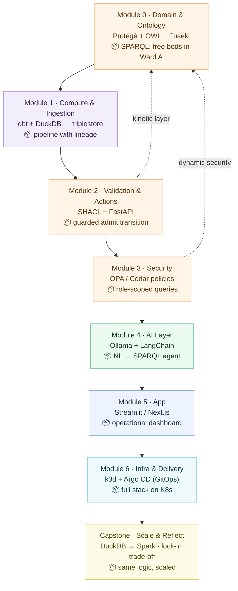

# Building a Reference Ontology Platform: An Incremental Systems Lab

**A hands-on lab course in operational data platforms**

This lab guides you through building a working reference implementation of an ontology-driven operational data platform, one stack layer at a time. By the end you will have a running **reference platform**: an operational application backed by a formal ontology, validated actions, role-based security, an AI query agent, and GitOps deployment on Kubernetes.

Everything runs on a laptop. No cloud account, API key, or paid service is required.

> ### 📌 Scope & limitations — read this first
>
> By completing this lab you will understand how an ontology-driven operational platform works by building a small one end-to-end. The result is a **learning prototype that runs on synthetic data** — it demonstrates every concept across the stack but is **not** built for scale, concurrent users, real data, or production use.
>
> This is deliberate. The goal is *understanding the architecture and the trade-offs*, not shipping a product. Treat the finished system as a **working prototype / reference implementation** — a demonstration of concepts, not a deployable platform. The Capstone makes the gap to production an explicit, assessed learning outcome.
>
> Throughout, "enterprise platform" refers to the general category of ontology-driven operational data platforms (the commercial products in this space), used only as a conceptual reference point.

---

## Running use case: Hospital Bed & Patient Flow

Every module builds on a single domain so the layers visibly connect. You will model and operate a simplified hospital bed-management system using **synthetic data only — never real patient information**.

Core domain objects: `Patient`, `Bed`, `Ward`, `Admission`.
Core relationships: a `Patient` *occupies* a `Bed`; a `Bed` *belongs to* a `Ward`.
Core actions: `admit`, `discharge`, `transfer`.

> **Alternative domain:** If you prefer, substitute *Fleet & Delivery Logistics* (`Vehicle`, `Route`, `Depot`, `Shipment`; actions `dispatch`, `reroute`, `deliver`). It has the same structure — every instruction below maps across directly.

---

## Lab roadmap

**Sequencing rationale:** the ontology core comes first (Module 0) so the central concept is established before any plumbing. Infrastructure (Modules 6) comes *last* — by then you have something worth deploying, which motivates the why. Each module produces an independently demoable deliverable.

---

## Prerequisites & toolchain

| Tool | Used in | Install |
|------|---------|---------|
| Python 3.11+ | M1, M2, M4, M5 | python.org / pyenv |
| Docker | M0–M6 | docker.com |
| Protégé (desktop) | M0 | protege.stanford.edu |
| Apache Jena Fuseki | M0–M5 | jena.apache.org/download |
| dbt-duckdb | M1 | `pip install dbt-duckdb` |
| FastAPI + uvicorn | M2 | `pip install fastapi uvicorn` |
| pySHACL | M2 | `pip install pyshacl` |
| Open Policy Agent | M3 | openpolicyagent.org |
| Ollama | M4 | ollama.com (then `ollama pull llama3.2`) |
| LangChain | M4 | `pip install langchain langchain-community` |
| Streamlit | M5 | `pip install streamlit` |
| k3d + kubectl | M6 | k3d.io |
| Argo CD | M6 | argo-cd.readthedocs.io |

**Skills assumed:** basic Python, basic SQL, comfort with a terminal and Git. No prior semantic-web or Kubernetes experience needed.

---

## Module 0 — Domain & Ontology

**Layer:** Ontology (semantic model)
**Component:** Protégé (authoring) · OWL/RDF · Apache Jena Fuseki (triplestore + SPARQL)
**Time:** 3–4 hours

### Learning objectives
By the end you can: define classes, object properties, and restrictions in OWL; load an ontology into a triplestore; and query instances with SPARQL.

### Concept
A platform ontology is a formal model of your domain — its object types, the links between them, and the rules they obey. This is the conceptual heart of ontology-driven platforms. OWL is the W3C standard for expressing it.

### Steps
1. In Protégé, create classes `Patient`, `Bed`, `Ward`, `Admission`.
2. Add object properties: `occupiesBed` (Patient → Bed), `inWard` (Bed → Ward).
3. Add a restriction: a `Bed` is occupied by **at most one** `Patient` (max cardinality 1). Run the reasoner (HermiT) and confirm consistency.
4. Add a handful of instances (3 wards, ~10 beds, a few patients) and save as Turtle (`hospital.ttl`).
5. Start Fuseki, create a dataset, and upload `hospital.ttl`.
6. Write SPARQL queries against the endpoint.

### Deliverable
A SPARQL query that returns all free beds in a named ward, run against your live Fuseki endpoint.

### Assessment criteria
- [ ] Ontology loads without reasoner errors
- [ ] At-most-one-patient restriction is present and validated
- [ ] "Free beds in Ward A" query returns correct results
- [ ] Student can explain the difference between a class and an instance

### Stretch
Add an `inferredOccupiedBed` via a property chain and show the reasoner deriving facts not explicitly stated.

---

## Module 1 — Compute & Ingestion

**Layer:** Compute / Data Plane
**Component:** dbt + DuckDB → triplestore loader
**Time:** 3 hours

### Learning objectives
Transform raw tabular data into clean, modelled form as *code*; understand lineage; load the result into the ontology.

### Concept
Real data arrives messy and tabular. The compute layer cleans and shapes it ("transform as code") before it populates the operational model. dbt makes transforms versionable and lineage-visible; DuckDB runs them in-process with no cluster.

### Steps
1. Generate a synthetic `admissions.csv` (~10k rows) with a provided script.
2. Initialise a dbt project using the `dbt-duckdb` adapter.
3. Build staging models (clean types, dedupe) and a mart model (`dim_bed`, `fct_admission`).
4. Run `dbt docs generate` and inspect the lineage graph.
5. Write a small Python loader that reads the dbt output and emits RDF triples into Fuseki (mapping rows to the Module 0 ontology).

### Deliverable
A reproducible pipeline: raw CSV → dbt transforms (with lineage docs) → instances in the triplestore.

### Assessment criteria
- [ ] dbt models run cleanly and are idempotent
- [ ] Lineage graph correctly shows source → staging → mart
- [ ] Triple count in Fuseki matches expected row counts
- [ ] Student can articulate schema-on-write vs schema-on-read

---

## Module 2 — Validation & Actions (Kinetic Layer)

**Layer:** Ontology (kinetic actions)
**Component:** SHACL validation + FastAPI action endpoint
**Time:** 4 hours

### Learning objectives
Implement a *guarded state transition* — the platform "Action" pattern: validate, then write, then log.

### Concept
This is the module that shows why OWL alone is not a platform. A model can describe valid states; it cannot *enforce* that writes respect them. You build that enforcement yourself with SHACL (shape validation) behind an API.

### Steps
1. Write SHACL shapes encoding business rules (e.g. *cannot admit a patient to an occupied bed*; *a patient cannot occupy two beds*).
2. Validate the current graph with pySHACL; confirm it passes.
3. Build a FastAPI `POST /admit` endpoint that: receives `{patient, bed}` → constructs the proposed graph change → validates with SHACL → if valid, issues a SPARQL Update → appends an audit log entry.
4. Test the guard: attempt an invalid admit and confirm it is rejected with a clear error.

### Deliverable
A working `admit` action that succeeds for valid requests and is *blocked* for invalid ones, with an audit trail.

### Assessment criteria
- [ ] Valid admit updates the graph and logs the action
- [ ] Invalid admit (occupied bed) is rejected before any write
- [ ] Audit log records who/what/when
- [ ] Student can explain why open-world OWL needs closed-world SHACL here

---

## Module 3 — Dynamic Security

**Layer:** Ontology (dynamic per-object security)
**Component:** Open Policy Agent (OPA)
**Time:** 2–3 hours

### Learning objectives
Enforce role- and attribute-based access so the *same query* returns *different results* per user.

### Concept
Operational platforms must show each user only what they are permitted to see — often down to the individual object. This is enforced at request time, not baked into the data.

### Steps
1. Define roles: `ward_nurse` (sees only their ward), `bed_manager` (sees all).
2. Write an OPA policy (Rego) that, given a user + role + requested ward, returns allow/deny and a ward filter.
3. Insert an authorization check in the Module 2 API: before answering a bed query, consult OPA and inject the ward filter into the SPARQL.
4. Run the same "show beds" request as two different roles; observe scoped results.

### Deliverable
One query, two roles, two correctly different result sets, gated by policy.

### Assessment criteria
- [ ] Ward nurse sees only their ward's beds
- [ ] Bed manager sees all beds
- [ ] Policy is external to application code (separation of concerns)
- [ ] Student can contrast this with static table-level permissions

---

## Module 4 — AI Layer

**Layer:** AI (platform AI layer)
**Component:** Ollama (local LLM) + LangChain
**Time:** 3–4 hours

### Learning objectives
Ground an LLM in the ontology so it answers operational questions accurately (natural language → SPARQL).

### Concept
The value of AI here is not a chatbot — it is an interface to the *operational model*. The LLM translates questions into SPARQL against your ontology, so answers are grounded in real, governed data rather than the model's memory.

### Steps
1. Pull a small local model with Ollama (`llama3.2` or `phi`).
2. Provide the ontology schema (class/property names) to the model as context.
3. Build a LangChain chain: question → LLM generates SPARQL → execute against Fuseki → LLM summarises the result rows in plain language.
4. Route the generated query through the Module 3 security filter so the agent respects permissions.
5. Test: "How many free beds are in the ICU?" / "Which patients are in Ward B?"

### Deliverable
A grounded Q&A agent that answers ward/bed questions via generated SPARQL, respecting security.

### Assessment criteria
- [ ] Agent produces valid SPARQL for at least 3 distinct questions
- [ ] Answers are correct against the ground-truth data
- [ ] Security filter is applied to agent queries (no permission bypass)
- [ ] Student can describe a failure mode (e.g. hallucinated property name) and a mitigation

> **Note:** keep questions within the modelled domain; discuss with students why grounding matters and how an ungrounded LLM would answer the same question unreliably.

---

## Module 5 — Application Layer

**Layer:** App / Presentation
**Component:** Streamlit (fast path) or Next.js (full-stack path)
**Time:** 3–4 hours

### Learning objectives
Build an operational interface that *reads* the model and *invokes* actions.

### Concept
This is the layer end-users actually touch: live operational state plus the buttons that change it. It ties every prior module together.

### Steps
1. Build a dashboard showing live ward occupancy (querying Fuseki).
2. Add an "Admit" and "Discharge" control that calls the Module 2 action API.
3. Reflect the user's role (Module 3) so the view is scoped.
4. Optionally embed the Module 4 agent as a query box.

### Deliverable
A working operational app — your reference platform — showing occupancy and performing guarded actions.

### Assessment criteria
- [ ] Dashboard reflects current triplestore state in real time
- [ ] Admit/discharge buttons invoke the validated action API
- [ ] Role scoping is visible in the UI
- [ ] App degrades gracefully when an action is rejected

---

## Module 6 — Infrastructure & Delivery

**Layer:** Container substrate + GitOps delivery
**Component:** k3d (local Kubernetes) + Argo CD (GitOps)
**Time:** 4 hours

### Learning objectives
Containerise the stack, deploy it to Kubernetes, and manage releases declaratively via GitOps.

### Concept
Now that you have something worth running, learn how platforms run it: containerised services on Kubernetes, deployed by committing manifests to Git and letting a controller reconcile the cluster to match.

### Steps
1. Write Dockerfiles for the API (M2), agent (M4), and app (M5); Fuseki has an official image.
2. Create a k3d cluster locally.
3. Write Kubernetes manifests (Deployments, Services) for each component.
4. Install Argo CD; point an Application at your Git repo of manifests.
5. Make a change in Git (e.g. bump a replica count) and watch Argo CD reconcile it automatically.

### Deliverable
The entire reference platform running on Kubernetes, deployed and updated through GitOps.

### Assessment criteria
- [ ] All components run as pods and are reachable via services
- [ ] Argo CD shows the app as Synced/Healthy
- [ ] A Git commit triggers an automatic, visible cluster change
- [ ] Student can explain GitOps reconciliation vs manual `kubectl apply`

---

## Capstone — Scale & Reflect

**Time:** 3 hours + written reflection

### Tasks
1. **Scale demonstration:** replace the DuckDB transform in Module 1 with a Spark job doing the equivalent work on the k3d cluster. Confirm identical output. Discuss: *the logic was portable; only the engine changed.*
2. **Gap analysis:** write a short reflection identifying what your reference platform still lacks versus a production-grade enterprise platform — integration depth, security accreditation (e.g. FedRAMP/IL levels), managed operations, the unified governed ontology, scale, concurrency, and high availability. Tie this back to the build-vs-buy trade-off: the things you did *not* have to build are exactly what a commercial vendor charges for, and being able to articulate that gap is itself a senior-level skill.

### What this prototype is NOT (required statement)

As part of the gap analysis, write down — in your own words — a clear statement of what the prototype is *not*. This is an assessed outcome, not a disclaimer to gloss over: being able to state it precisely is the strongest signal that you understand the architecture. At minimum, address that the prototype is **not**:

- **Production-grade** — it is a learning artifact running on synthetic data and a single laptop-scale instance.
- **Scalable as built** — DuckDB and a single triplestore handle thousands of rows; production handles billions across a cluster.
- **Concurrency-safe** — it is single-user; it does not handle simultaneous conflicting writes, transactions across services, or race conditions.
- **Hardened** — the access policy is illustrative, not real authentication, secrets management, network policy, or audited security.
- **Integration-complete** — it ingests one clean synthetic source, not hundreds of messy live ones with change-data-capture and schema-drift handling.
- **Operated** — no monitoring, alerting, backup/restore, HA/DR, or upgrade path.

The point of naming these is not to diminish what you built — it is to show you know exactly where the boundary lies, which is precisely the judgment an employer in this space is hiring for.

### Deliverable
A working Spark-based pipeline plus a 1–2 page written gap-and-trade-off analysis that includes the "what this is NOT" statement.

### Assessment criteria
- [ ] Spark pipeline produces output matching the DuckDB version
- [ ] Reflection correctly identifies at least four real-world production gaps
- [ ] "What this is NOT" statement is present, accurate, and in the student's own words
- [ ] Reflection articulates the build-vs-buy trade-off with nuance

---

## Mapping to the platform stack

| Module | Stack layer built | Reference-platform component | Enterprise-platform analogue |
|--------|-------------------|------------------------|------------------------|
| 0 | Ontology (model) | OWL + Fuseki | Ontology semantic model |
| 1 | Compute | dbt + DuckDB | Spark/Flink data plane |
| 2 | Ontology (kinetic) | SHACL + FastAPI | Validated action services |
| 3 | Ontology (security) | OPA | Dynamic per-object security |
| 4 | AI | Ollama + LangChain | Grounded platform AI agents |
| 5 | App | Streamlit / Next.js | Operational apps |
| 6 | Substrate + Delivery | k3d + Argo CD | Container substrate + GitOps delivery |
| Capstone | Scale | Spark | Production compute |

---

## Notes for instructors

- **Pacing:** Modules 0, 2, and 4 are the conceptual peaks and deserve the most time; 1, 3, 5, 6 are shorter. Total ≈ 30 hours, suitable for a semester lab strand or an intensive week.
- **Formative checkpoints:** each module's deliverable is a natural demo/check-in point. The assessment checklists double as self-assessment for students.
- **Constructive alignment:** objectives → activities (build steps) → assessment criteria are aligned per module. Bloom's progression runs from *understand/apply* (M0–M1) through *analyse/create* (M2–M5) to *evaluate* (Capstone reflection).
- **Safety/ethics:** reinforce synthetic-data-only throughout; the capstone reflection is a good place to discuss data governance and vendor dependency as professional concerns.
